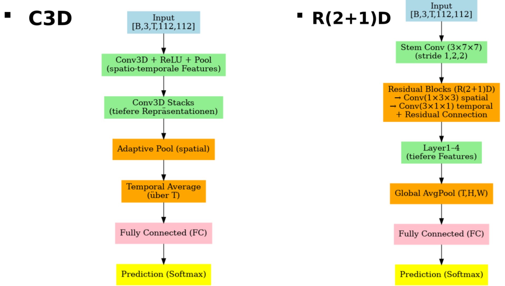
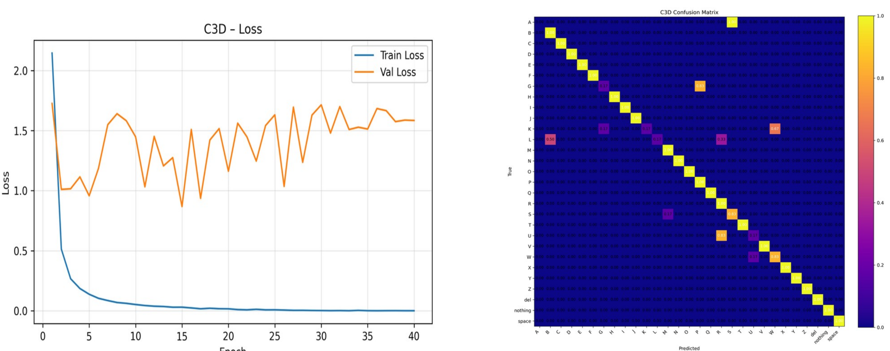
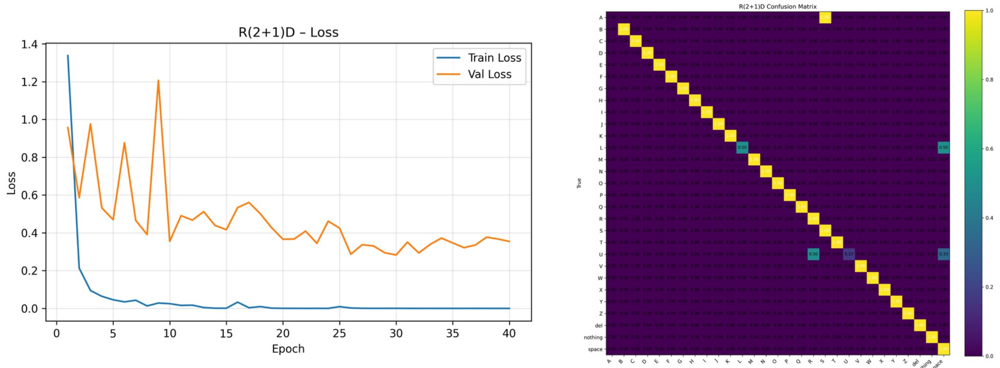
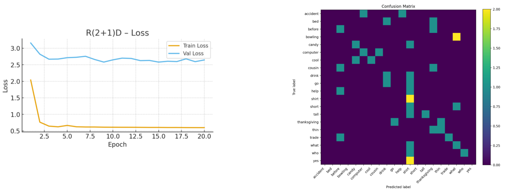

# ASL-Erkennung mit 3D-CNNs (Python / PyTorch)

<p align="center">
  <a href="https://asl-demo-8ubwp8umsiauhfxadbvuqt.streamlit.app/">
    
  </a>
</p>

> End-to-End-Deep-Learning-Pipeline, die amerikanische Gebärdensprache aus Bildern und Videos erkennt — MediaPipe-Handausschnitt, C3D-/R(2+1)D-18-Backbones, Transfer Learning aus Kinetics-400 und eine Live-Webcam-Demo.

Eine praxisnahe Pipeline zur Erkennung der **amerikanischen Gebärdensprache (ASL)**, die sowohl **statisches Fingeralphabet (T=1)** als auch **dynamische Wort-Clips (T>1)** abdeckt. Der Fokus liegt auf **handzentrierter Vorverarbeitung** (MediaPipe-Ausschnitte), **Augmentierung**, effizienten **C3D-/R(2+1)D-18-Backbones** und sauberen **Trainings-/Eval-Schleifen**.

**Highlights:** R(2+1)D erreicht **91,9 % Top-1** auf dem statischen ASL-Alphabet; Transfer Learning hebt die Genauigkeit bei dynamischen Wörtern von **~10 % auf ~30 %** im Szenario mit wenig Daten. Umgesetzt mit Python, PyTorch, torchvision und MediaPipe.

<p align="center">
  <a href="https://asl-demo-8ubwp8umsiauhfxadbvuqt.streamlit.app/">
    
  </a>
  <br>
  <em>Echtzeit-Fingeralphabet mit Top-3-Vorhersagen pro Frame — <a href="https://asl-demo-8ubwp8umsiauhfxadbvuqt.streamlit.app/">Live-Demo ausprobieren →</a></em>
</p>

📄 Ein einseitiges **[Poster](poster.pdf)** fasst Ansatz und Ergebnisse zusammen.

---

## 1) Plan / Roadmap

**Phase 1 — Statisch (Fingeralphabet, Kaggle ASL Alphabet)**

1. **Daten:** Kaggle ASL Alphabet beschaffen; in Train/Val strukturieren.

2. **Vorverarbeitung:** Handausschnitte (MediaPipe), skalieren/normalisieren.

3. **Training:** (Aufwärm-)Training mit **R(2+1)D** und **C3D** bei T=1; Baselines etablieren.

4. **Evaluation:** Top-1/Top-5 und Confusion Matrix; Erkenntnisse auf Phase 2 übertragen.

**Phase 2 — Dynamisch (Wortebene, WLASL)**

1. **Klassenauswahl:** 20 Klassen wählen.

2. **Beschaffung & Stichprobe:** Gemäß offiziellem Repo herunterladen; Sample-Qualität/Labels prüfen.

3. **Vorverarbeitung:** Hand-Bounding-Box-Ausschnitte anwenden; skalieren/normalisieren.

4. **Clip-Sampling:** T=16 verwenden (Stride anpassen, um das Zeichen abzudecken).

5. **Backbones:** **R(2+1)D** und **C3D** vergleichen (vortrainiert, wo möglich).

6. **Augmentierung:** Leichtes räumliches Jittering; zeitliches Sampling/Jittering; keine Umkehrung.

7. **Training:** Sauberes Setup, Checkpoints, Early Stopping.

8. **Evaluation:** Top-1/Top-5, Macro-F1, Confusion Matrix.

9. **Analyse:** Verwechslungen identifizieren; Daten und Hyperparameter verfeinern.

**Phase 3 — Abschluss**

- **Inferenz:** Minimale Webcam-Demo.

- **Dokumentation:** Setup, Metriken und gewonnene Erkenntnisse.

---

## 2) Architekturen

Das **Backbone** ist der Merkmals-Extraktor **vor** dem Global Average Pooling und dem finalen vollverbundenen Klassifikator. Beide Modelle geben gepoolte Merkmale aus, die in einen linearen Kopf fließen.

### C3D

- Gestapelte **3×3×3**-Faltungen mit **nur räumlichem Max-Pooling** in den frühen Stufen (kein zeitliches Downsampling), dann **zeitlicher Mittelwert** vor dem Klassifikator.

- Forward: `[B,C,T,H,W] → features → [B,512,T,1,1] → Mittel über H,W dann T → fc`.

### R(2+1)D-18

- Zerlegt eine 3D-Faltung in **(1×3×3 räumlich)** → BN/ReLU → **(3×1×1 zeitlich)** innerhalb eines Residualblocks.

- Nur **räumliches** Downsampling (stride=(1,2,2)); **T bleibt erhalten** durch das Backbone; abschließend **Global Average Pooling** über (T,H,W) → fc.



---

## 3) Datensätze

**Statisch — Kaggle ASL Alphabet**  
~**87.000** Bilder, **29 Klassen** (A–Z + SPACE/DELETE/NOTHING), **200×200 px**; ordnerbasiert organisiert und ideal für Phase 1.

**Dynamisch — WLASL (Word-Level ASL)**  
Wir nutzen das offizielle Repository (Li et al., WACV’20). WLASL liefert JSON-Metadaten (inkl. `bbox`) und ist unter **C-UDA (nur für Forschung)** lizenziert.

**Frame-Ordner-Layout fürs Training**

```text
<DATA_ROOT>/train/<class>/<clip_id>_aug####/frame_*.png
<DATA_ROOT>/test/<class>/<clip_id>/frame_*.png

# Outputs produced by the augmenters
<OUT_ROOT>/preprocessed/<class>/<clip_id>/frame_*.png      # dynamic
<OUT_ROOT>/augmented/<class>/<clip_id>_aug####/frame_*.png # dynamic

<OUT_ROOT>/preprocessed/<class>/*.png                      # static
<OUT_ROOT>/augmented/<class>/*_aug####.png                 # static

<OUT_ROOT>/{metadata.json, splits.json, classes.json}
```

(Erzeugt von `aug_dynamic.py` / `aug_static.py`; von `train_dynamic.py` und `train_dynamic_tune.py` als **Frame-Ordner** eingelesen.)

---

## 4) Repo-Überblick

```text
.
├── Dockerfile                     # Container-Image für die REST-API
├── api/
│   └── serve.py                   # FastAPI-Vorhersagedienst
├── demo.py                        # Webcam inference demo
├── requirements.txt
├── src/
│   ├── models.py                  # C3D & R(2+1)D-18 backbones + classifier head
│   ├── metrics.py                 # Top-k, confusion matrix, Macro-F1
│   ├── static/
│   │   ├── aug_static.py          # Static preprocessing & augmentation
│   │   └── train_static.py        # Unified static/dynamic trainer
│   └── dynamic/
│       ├── aug_dynamic.py         # Dynamic (clip) preprocessing & augmentation
│       ├── train_dynamic.py       # From-scratch C3D / R(2+1)D trainer
│       └── train_dynamic_tune.py  # Fine-tune torchvision R(2+1)D-18
└── utils/
    ├── extract_frames.py          # Video → frames
    └── organize_wlasl.py          # Flat WLASL videos → per-class folders
```

- **[`src/dynamic/aug_dynamic.py`](src/dynamic/aug_dynamic.py)** — Dynamische Vorverarbeitung & **zeitlich konsistente** Augmentierung; MediaPipe-**Vereinigungs-Handbox** über einen Stride; schreibt `preprocessed/`, `augmented/` und `metadata.json` / `splits.json`.

- **[`src/dynamic/train_dynamic.py`](src/dynamic/train_dynamic.py)** — Trainiert **C3D / R(2+1)D** auf **Frame-Ordner-Clips** mit **RAM-Caching**; testet jede Epoche; TensorBoard + CSV-/JSON-Verlauf; Confusion-Assets.

- **[`src/dynamic/train_dynamic_tune.py`](src/dynamic/train_dynamic_tune.py)** — **Feintuning** von torchvision `r2plus1d_18` (Kinetics-400): stufenweises Einfrieren (`stem/layer1/layer2`), BN-Eval-Freeze, **separate LRs** (Backbone/Kopf), **konfigurierbare Unfreeze-Epoche**.

- **[`src/static/train_static.py`](src/static/train_static.py)** — Einheitlicher Trainer für **statisch (T=1)** und **dynamisch (Videos)**; sorgfältiges AMP-Handling für **PyTorch 1.x / 2.x**.

- **[`src/static/aug_static.py`](src/static/aug_static.py)** — Statische Vorverarbeitung & Augmentierung mit MediaPipe Hands; erzeugt `metadata.json` + `splits.json`; gibt `preprocessed/` und `augmented/` aus.

- **[`src/models.py`](src/models.py)** — **C3D**- und **R(2+1)D-18**-Backbones (zeitlich erhalten), **Global Average Pooling**, Klassifikatorkopf.

- **[`src/metrics.py`](src/metrics.py)** — Top-k-Genauigkeit, laufende **Confusion Matrix**, **Macro-F1**, Plot-/Speicher-Hilfsfunktionen.

- **[`utils/extract_frames.py`](utils/extract_frames.py)** — Extrahiert Frames aus Videos mit **Resize(short=128) + CenterCrop(112)**; konfigurierbares `--stride` (z. B. jeder 2. Frame).

- **[`utils/organize_wlasl.py`](utils/organize_wlasl.py)** — Von flachen WLASL-Videos + JSON-Annotationen zu **klassenweisen** Ordnern; Kopieren/Verschieben und Vorschau-CSVs.

- **[`demo.py`](demo.py)** — Webcam-Demo (statisch/dynamisch), optionaler MediaPipe-Ausschnitt, robuster Checkpoint-Loader (eigen oder torchvision), Klassen-Erkennung, Top-k auf dem Bild.

- **[`api/serve.py`](api/serve.py)** — FastAPI-Dienst, der das statische C3D-Modell als REST-API bereitstellt (`/predict`, `/health`).

---

## 5) Schnellstart

**Installation**

```bash
# 1) Install PyTorch (pick the build matching your CUDA / CPU setup):
pip install torch torchvision --index-url https://download.pytorch.org/whl/cu121

# 2) Install the remaining dependencies:
pip install -r requirements.txt
```

**1) WLASL organisieren (dynamisch)**

```bash
python utils/organize_wlasl.py \
  --src /path/flat_videos \
  --ann /path/wlasl.json \
  --out /path/wlasl_by_class \
  --copy
# Preview only: add --preview_only
```

**2) (Optional) Frames extrahieren (z. B. jeden 2. Frame)**

```bash
python utils/extract_frames.py \
  --src /path/wlasl_by_class \
  --dst /path/wlasl_frames \
  --stride 2
```

> **Hinweis:** Der Code unter `src/` ist ein Python-Paket. Führe die Trainings-/Augmentierungs-
> Skripte als **Module vom Repo-Root** aus (`python -m src....`), damit die internen
> Imports korrekt aufgelöst werden.

**3) Statische Vorverarbeitung & Augmentierung**

```bash
python -m src.static.aug_static /path/asl_alphabet \
  --dst_root /path/asl_static_processed
```

**4) Dynamische Vorverarbeitung & zeitlich konsistente Augmentierung**

```bash
python -m src.dynamic.aug_dynamic /path/wlasl_by_class \
  --dst_root /path/wlasl_processed_dyn
```

**5) Training (statisch)**

```bash
python -m src.static.train_static \
  --data /path/asl_static_processed \
  --data-type static \
  --model r2plus1d \
  --save-dir runs/asl_static
```

**6) Training (dynamisch)**

```bash
python -m src.dynamic.train_dynamic \
  --data-root /path/wlasl_frame_data \
  --model r2plus1d \
  --save-dir runs/asl_dynamic
```

**7) Feintuning torchvision R(2+1)D-18 (Kinetics-400)**

```bash
python -m src.dynamic.train_dynamic_tune \
  --data-root /path/wlasl_frame_data \
  --save-dir runs/asl_dynamic_ft
```

**8) Demo (Webcam)**

```bash
python demo.py \
  --runs runs/asl_dynamic_ft \
  --device auto \
  --mode dynamic
```

---

## 6) Vorverarbeitung

**Statisch (`aug_static.py`)**

- **Handausschnitt + Rand**, quadratisch, Skalierung auf `target_size` (Standard 112).

- Augmentierungen (leicht): **HFlip**, **ColorJitter**, **RandomResizedCrop**, kleine Rotationen, **Gaußscher Weichzeichner**.

- Train/Test-Split auf **Original-Ebene**; augmentierte Samples erben den Split ihres Originals.

**Dynamisch (`aug_dynamic.py`)**

- **Vereinigungs-Hand-Bounding-Box über den Clip** (MediaPipe auf einem Stride), quadratisch + Rand, **gleicher Ausschnitt über alle Frames**, Skalierung.

- **Zeitlich konsistente** Augmentierungen: dieselben Zufallsparameter (Flip, Jitter, Ausschnittfenster, Rotation, Weichzeichner) werden auf jeden Frame eines Clips angewendet.

- Erzeugt **`metadata.json`** pro Clip und **`splits.json`** (Listen der Clip-Verzeichnisse).

---

## 7) Evaluationsstrategie

- **Top-1- / Top-5-Genauigkeit** — Primäre Korrektheit (Top-1) und Abdeckung der Kandidatenmenge (Top-5).

- **Macro-F1** — Klassenausgewogene Sicht zur Abschwächung schiefer Klassenhäufigkeiten (entscheidend auf Wortebene).

- **Confusion Matrix** — Zeigt, welche Zeichen verwechselt werden; leitet gezielte Daten-/Augmentierungs-Korrekturen.

### 

### Ergebnisse

**Statisch (Kaggle ASL Alphabet)**

- **C3D:** Loss 2,14 → 0,0008; **Acc@1 83,9 %**, **Macro-F1 80,6 %**.

- **R(2+1)D:** Loss 1,33 → 0,0001; **Acc@1 91,9 %**, **Macro-F1 90,1 %**.








**Dynamisch (WLASL-Teilmenge, 20 Klassen)**

- **Feingetuntes R(2+1)D-18 (Kinetics-400):** Train-Loss 2,0406 → 0,5985; **Acc@1 30 %**, **Macro-F1 27,6 %**.

- **R(2+1)D-18 von Grund auf:** **Acc@1 ≈ 10 %**.





**Interpretation (erzählend)**  

Auf dem **statischen ASL-Alphabet** konvergieren beide Backbones schnell, aber **R(2+1)D** generalisiert besser als **C3D** — seine Validierungskurve stabilisiert sich niedriger und die Confusion Matrix zeigt eine sauberere Diagonale, was auf weniger systematische Verwechslungen zwischen ähnlichen Handformen hindeutet.

Bei **dynamischer ASL auf Wortebene** übertrifft das **Feintuning** von torchvision **R(2+1)D-18** aus **Kinetics-400** das Training derselben Architektur **von Grund auf** deutlich (~30 % vs. ~10 % Acc@1). Der feingetunte Lauf zeigt eine sich abzeichnende Diagonale, aber viele Fehler abseits der Diagonale — passend zu begrenzten und heterogenen Daten. Entscheidend wird der Vergleich durch die **Datenmenge** begrenzt: Der statische Datensatz bietet grob **~3.000 Bilder pro Klasse**, während der dynamische nur **~10–15 Clips pro Klasse über 20 Klassen** liefert. Dieses Ungleichgewicht erklärt die schwächeren absoluten Zahlen bei dynamischer ASL. Zeitlich konsistente Augmentierung verbessert zwar die Robustheit, **kann echte zeitliche Vielfalt aber nicht ersetzen** (Signer, Blickwinkel, Bewegungsverläufe) — weshalb Augmentierung in diesem Regime **wenig geholfen hat**.

**Fazit:** **R(2+1)D** ist das stärkere Backbone, und **Transfer Learning ist unverzichtbar** für Video mit wenig Daten. Um die dynamische Leistung zu steigern, sollte man vorrangig mehr Clips pro Klasse sammeln (oder zusätzliches Pretraining nutzen), Klassen ausbalancieren und die Augmentierung auf Bewegung fokussieren (zeitliches Jittering, Geschwindigkeitsvariation, Hintergrundvariabilität), während der handzentrierte Ausschnitt stabil bleibt.

---

## 8) Serving: REST-API & Docker

Das statische C3D-Modell wird zusätzlich als **REST-API** (FastAPI) bereitgestellt und lässt sich **containerisiert** per Docker starten — das Modell wird also nicht nur trainiert, sondern auch produktionsnah ausgeliefert.

**Endpunkte**

- `GET /health` — Statuscheck (Anzahl Klassen, Gerät).
- `POST /predict` — nimmt ein Bild (Datei-Upload) entgegen und liefert die Top-k-Vorhersagen als JSON. Optionaler Query-Parameter `top_k` (Standard 3).

Die Modellgewichte werden beim ersten Start automatisch vom GitHub-Release geladen (anpassbar über `ASL_MODEL_URL` / `ASL_MODEL_PATH`).

**Lokal starten**

```bash
pip install -r api/requirements.txt
uvicorn api.serve:app --reload
# Interaktive API-Doku (Swagger UI): http://127.0.0.1:8000/docs
```

**Beispielanfrage**

```bash
curl -F "file=@hand.jpg" "http://127.0.0.1:8000/predict?top_k=3"
# {"hand_detected": true,
#  "predictions": [{"label": "C", "probability": 0.71}, ...]}
```

**Mit Docker**

```bash
docker build -t asl-api .
docker run -p 8000:8000 asl-api
# API danach unter http://127.0.0.1:8000
```

---

## Referenzen

- Tran et al., **C3D** (ICCV 2015).

- Carreira & Zisserman, **I3D** (CVPR 2017).

- Tran et al., **R(2+1)D** (CVPR 2018).

- Feichtenhofer et al., **SlowFast** (ICCV 2019).

- **Kaggle ASL Alphabet**-Datensatz.

- Li et al., **WLASL** (WACV 2020) & offizielles Repo.

- **MediaPipe Hands**-Dokumentation.
