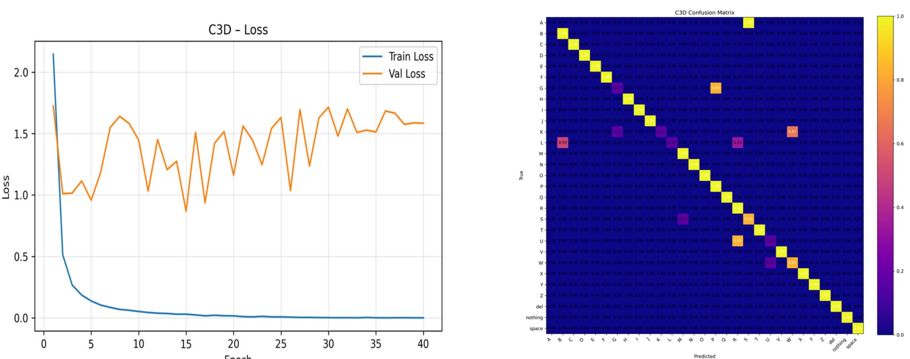

Nice! I gave your README a careful pass for clarity, formatting, grammar, and consistency with your code and workflow. Below is a **clean, drop-in replacement** that preserves your structure, fixes wording, and makes the commands and paths copy-paste friendly. I also folded in your final results narrative (incl. the data-scale caveat for dynamic ASL and limited augmentation gains).

---

# ASL Recognition with 3D CNNs (Python / PyTorch)

A practical pipeline for **American Sign Language (ASL)** recognition covering **static fingerspelling (T=1)** and **dynamic word-level clips (T>1)**. It focuses on **hand-centric preprocessing** (MediaPipe crops), **augmentation**, efficient **C3D / R(2+1)D-18** backbones, and clean **train/eval loops**.

---

## 1) Plan / Roadmap

**Phase 1 — Static (Fingerspelling, Kaggle ASL Alphabet)**

1. **Data:** Fetch Kaggle ASL Alphabet; structure into train/val.

2. **Preprocessing:** Hand crops (MediaPipe), resize/normalize.

3. **Training:** Train (warm-up) using **R(2+1)D** and **C3D** with T=1; establish baselines.

4. **Evaluation:** Top-1/Top-5 and confusion matrix; transfer lessons to Phase 2.

**Phase 2 — Dynamic (Word-Level, WLASL)**

1. **Class Selection:** Choose 20 classes.

2. **Acquisition & Spot-Check:** Download per official repo; verify sample quality/labels.

3. **Preprocessing:** Apply hand bbox crops; resize/normalize.

4. **Clip Sampling:** Use T=16 (adjust stride to cover the sign).

5. **Backbones:** Compare **R(2+1)D** and **C3D** (pretrained where applicable).

6. **Augmentation:** Mild spatial jitter; temporal sampling/jitter; avoid reversal.

7. **Training:** Clean setup, checkpoints, early stopping.

8. **Evaluation:** Top-1/Top-5, Macro-F1, confusion matrix.

9. **Analysis:** Identify confusions; refine data and hyperparameters.

**Phase 3 — Wrap-Up**

- **Inference:** Minimal webcam demo.

- **Documentation:** Setup, metrics, and lessons learned.

---

## 2) Architectures

The **backbone** is the feature extractor **before** global average pooling and the final fully-connected classifier. Both models output pooled features that feed a linear head.

### C3D

- Stacked **3×3×3** convolutions with **spatial max-pooling only** in early stages (no temporal downsampling), then **temporal mean** before the classifier.

- Forward: `[B,C,T,H,W] → features → [B,512,T,1,1] → mean over H,W then T → fc`.

### R(2+1)D-18

- Factorizes a 3D conv into **(1×3×3 spatial)** → BN/ReLU → **(3×1×1 temporal)** within a residual block.

- **Spatial** downsampling only (stride=(1,2,2)); **T is preserved** through the backbone; final **global average pool** over (T,H,W) → fc.


---

## 3) Datasets

**Static — Kaggle ASL Alphabet**  
~**87,000** images, **29 classes** (A–Z + SPACE/DELETE/NOTHING), **200×200 px**; folder-organized and ideal for Phase 1.

**Dynamic — WLASL (Word-Level ASL)**  
We use the official repository (Li et al., WACV’20). WLASL provides JSON metadata (incl. `bbox`) and is **C-UDA (research-only)** licensed.

**Frame-folder layout for training**

```text
<DATA_ROOT>/train/<class>/<clip_id>_aug####/frame_*.png
<DATA_ROOT>/test/<class>/<clip_id>/frame_*.png

# Outputs produced by the augmenters
<OUT_ROOT>/preprocessed/<class>/<clip_id>/frame_*.png      # dynamic
<OUT_ROOT>/augmented/<class>/<clip_id>_aug####/frame_*.png # dynamic

<OUT_ROOT>/preprocessed/<class>/*.png                      # static
<OUT_ROOT>/augmented/<class>/*_aug####.png                 # static

<OUT_ROOT>/{metadata.json, splits.json, classes.json}
```

(Produced by `aug_dynamic.py` / `aug_static.py`; consumed by `train_dynamic.py` and `train_dynamic_tune.py` as **frame folders**.)

---

## 4) Repo Overview

- **`aug_dynamic.py`** — Dynamic preprocessing & **temporally consistent** augmentation; MediaPipe **union hand box** over a stride; writes `preprocessed/`, `augmented/`, and `metadata.json` / `splits.json`.

- **`train_dynamic.py`** — Trains **C3D / R(2+1)D** on **frame-folder clips** with **RAM caching**; tests every epoch; TensorBoard + CSV/JSON history; confusion assets.

- **`train_dynamic_tune.py`** — **Fine-tunes** torchvision `r2plus1d_18` (Kinetics-400): staged freezing (`stem/layer1/layer2`), BN eval-freeze, **separate LRs** (backbone/head), **configurable unfreeze epoch**.

- **`train_static.py`** — Unified trainer for **static (T=1)** and **dynamic (videos)**; careful AMP handling for **PyTorch 1.x / 2.x**.

- **`aug_static.py`** — Static preprocessing & augmentation with MediaPipe hands; creates `metadata.json` + `splits.json`; outputs `preprocessed/` and `augmented/`.

- **`models.py`** — **C3D** and **R(2+1)D-18** backbones (temporal preserved), **global average pool**, classifier head.

- **`metrics.py`** — Top-k accuracy, running **confusion matrix**, **Macro-F1**, plotting/saving utilities.

- **`extract_frames.py`** — Extract frames from videos with **Resize(short=128) + CenterCrop(112)**; configurable `--stride` (e.g., every 2nd frame).

- **`organize_wlasl.py`** — From flat WLASL videos + JSON annotations to **per-class** folders; copy/move and preview CSVs.

- **`demo.py`** — Webcam demo (static/dynamic), optional MediaPipe crop, robust checkpoint loader (custom or torchvision), class discovery, on-screen Top-k.

---

## 5) Quick Start

**Install**

```bash
pip install torch torchvision torchaudio --index-url https://download.pytorch.org/whl/cu121
pip install mediapipe opencv-python pillow tensorboard matplotlib
```

**1) Organize WLASL (dynamic)**

```bash
python organize_wlasl.py \
  --src /path/flat_videos \
  --ann /path/wlasl.json \
  --out /path/wlasl_by_class \
  --copy
# Preview only: add --preview_only
```

**2) (Optional) Extract frames (e.g., every 2nd frame)**

```bash
python extract_frames.py \
  --src /path/wlasl_by_class \
  --dst /path/wlasl_frames \
  --stride 2
```

**3) Static preprocessing & augmentation**

```bash
python aug_static.py /path/asl_alphabet \
  --dst_root /path/asl_static_processed
```

**4) Dynamic preprocessing & temporally consistent augmentation**

```bash
python aug_dynamic.py /path/wlasl_by_class \
  --dst_root /path/wlasl_processed_dyn
```

**5) Train (static)**

```bash
python train_static.py \
  --data /path/asl_static_processed \
  --data-type static \
  --model r2plus1d \
  --save-dir runs/asl_static
```

**6) Train (dynamic)**

```bash
python train_dynamic.py \
  --data-root /path/wlasl_frame_data \
  --model r2plus1d \
  --save-dir runs/asl_dynamic
```

**7) Fine-tune torchvision R(2+1)D-18 (Kinetics-400)**

```bash
python train_dynamic_tune.py \
  --data-root /path/wlasl_frame_data \
  --save-dir runs/asl_dynamic_ft
```

**8) Demo (webcam)**

```bash
python demo.py \
  --runs runs/asl_dynamic_ft \
  --device auto \
  --mode dynamic
```

---

## 6) Preprocessing

**Static (`aug_static.py`)**

- **Hand crop + margin**, square, resize to `target_size` (default 112).

- Augmentations (mild): **HFlip**, **ColorJitter**, **RandomResizedCrop**, small rotations, **Gaussian blur**.

- Train/test split at the **original level**; augmented samples inherit their original’s split.

**Dynamic (`aug_dynamic.py`)**

- **Union hand bbox across the clip** (MediaPipe on a stride), square + margin, **same crop across frames**, resize.

- **Temporally consistent** augs: the same random params (flip, jitter, crop window, rotation, blur) are applied to every frame of a clip.

- Emits **`metadata.json`** per clip and **`splits.json`** (lists of clip directories).

---

## 7) Evaluation Strategy

- **Top-1 / Top-5 Accuracy** — Primary correctness (Top-1) and candidate-set coverage (Top-5).

- **Macro-F1** — Class-balanced view to mitigate skewed class frequencies (critical for word-level).

- **Confusion Matrix** — Reveals which signs are conflated; guides targeted data/aug fixes.

### 

### Results

**Static (Kaggle ASL Alphabet)**

- **C3D:** Loss 2.14 → 0.0008; **Acc@1 83.9%**, **Macro-F1 80.6%**.

- **R(2+1)D:** Loss 1.33 → 0.0001; **Acc@1 91.9%**, **Macro-F1 90.1%**.





**Dynamic (WLASL subset, 20 classes)**

- **Fine-tuned R(2+1)D-18 (Kinetics-400):** Train loss 2.0406 → 0.5985; **Acc@1 30%**, **Macro-F1 27.6%**.

- **From-scratch R(2+1)D-18:** **Acc@1 ≈ 10%**.


**Interpretation (narrative)**  

On the **static ASL alphabet**, both backbones converge quickly, but **R(2+1)D** generalizes better than **C3D**—its validation curve stabilizes lower and the confusion matrix shows a cleaner diagonal, indicating fewer systematic mix-ups between similar handshapes.

For **dynamic word-level ASL**, **fine-tuning** torchvision **R(2+1)D-18** from **Kinetics-400** clearly outperforms training the same architecture **from scratch** (~30% vs. ~10% Acc@1). The fine-tuned run exhibits an emerging diagonal yet many off-diagonal errors consistent with limited and heterogeneous data. Crucially, the comparison is constrained by **data scale**: the static set offers roughly **~3,000 images per class**, whereas the dynamic set provides only **~10–15 clips per class across 20 classes**. This imbalance explains the weaker absolute numbers on dynamic ASL. Although temporally consistent augmentation improves robustness, it **cannot substitute for real temporal diversity** (signers, viewpoints, motion trajectories), which is why augmentation **did not help much** in this regime.

**Bottom line:** **R(2+1)D** is the stronger backbone, and **transfer learning is essential** for low-data video. To lift dynamic performance, prioritize collecting more clips per class (or leveraging additional pretraining), rebalance classes, and focus augmentation on motion (temporal jitter, speed perturbation, background variability) while keeping the hand-centric crop stable.

---

## References

- Tran et al., **C3D** (ICCV 2015).

- Carreira & Zisserman, **I3D** (CVPR 2017).

- Tran et al., **R(2+1)D** (CVPR 2018).

- Feichtenhofer et al., **SlowFast** (ICCV 2019).

- **Kaggle ASL Alphabet** dataset.

- Li et al., **WLASL** (WACV 2020) & official repo.

- **MediaPipe Hands** documentation.
